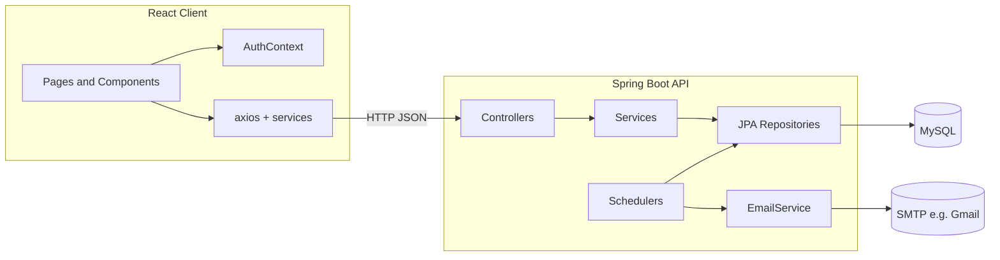

# Smart Deadline Tracking System (SDTS)

Full-stack application for managing personal tasks with due dates, priorities, statuses, a dashboard, calendar view, and automated email reminders. The system uses a **Spring Boot** REST API with **MySQL**, and a **React (Vite)** single-page client.

## Architecture



## Repository layout

| Path | Role |
|------|------|
| `client/` | React 19 + Vite 7 SPA: routing, UI, calls to backend |
| `sdts-backend/sdts-backend/` | Spring Boot 3.5 API, JPA entities, schedulers, mail |

## Technology stack

- **Backend:** Java 21, Spring Boot 3.5, Spring Data JPA, MySQL, Spring Mail, BCrypt (via `spring-security-crypto`)
- **Frontend:** React 19, React Router 7, Axios, date-fns, react-big-calendar, recharts, react-toastify
- **Ops:** Dockerfile for the JAR, optional Vercel config under `client/`

## Features (current behavior)

- **Users:** Register with username, email, and password (stored as BCrypt hash). Login returns user JSON (password omitted).
- **Tasks:** CRUD-style operations: create, list by user, full update, mark completed, delete. Optional filters by due date, priority, or status (API-level).
- **Status:** `PENDING`, `COMPLETED`, `OVERDUE`. New tasks with a due date in the past start as `OVERDUE`.
- **Reminders:** A scheduler finds tasks due within the next 24 hours, sends one email per task (tracked with `reminderSent`), and skips completed tasks.
- **Overdue sweep:** A scheduler marks non-completed tasks as `OVERDUE` when the calendar date of `dueDate` is before today.
- **Client:** Session is represented by `user` object in `localStorage` (no JWT). Protected routes redirect to login.

## Prerequisites

- JDK 21 and Maven (or use the included `mvnw` / `mvnw.cmd`)
- Node.js 18+ (for the client)
- MySQL server and SMTP credentials (for mail features)

## Environment variables

### Backend (`sdts-backend/sdts-backend`)

Set these before running (or in your IDE / hosting platform). Example for local dev:

| Variable | Purpose |
|----------|---------|
| `DATABASE_URL` | JDBC URL, e.g. `jdbc:mysql://localhost:3306/sdts?createDatabaseIfNotExist=true` |
| `DATABASE_USERNAME` | MySQL user |
| `DATABASE_PASSWORD` | MySQL password |
| `MAIL_USERNAME` | SMTP username (e.g. Gmail address) |
| `MAIL_PASSWORD` | SMTP app password |
| `PORT` | Optional; server port (default **8080** if unset) |

`application.properties` uses `spring.jpa.hibernate.ddl-auto=update` so schema is created/updated from entities on startup.

### Frontend (`client/`)

| Variable | Purpose |
|----------|---------|
| `VITE_API_URL` | Base URL of the API (e.g. `http://localhost:8080`). If unset, the client defaults to `http://localhost:8080`. |

Create a `.env` file in `client/` (do not commit secrets):

```env
VITE_API_URL=http://localhost:8080
```

## How to run locally

### 1. Database and mail

Create a MySQL database (or rely on `createDatabaseIfNotExist` in the URL). Configure SMTP; for Gmail, use an [app password](https://support.google.com/accounts/answer/185833).

### 2. Backend

```bash
cd sdts-backend/sdts-backend
./mvnw spring-boot:run
```

On Windows:

```bash
cd sdts-backend\sdts-backend
mvnw.cmd spring-boot:run
```

API listens on port **8080** by default.

### 3. Client

```bash
cd client
npm install
npm run dev
```

Vite typically serves at **http://localhost:5173**. CORS is configured for localhost and the production Vercel URL in `CorsConfig.java`; controller-level `@CrossOrigin` also targets `http://localhost:5173`.

## API reference (summary)

Base path: server root (no `/api` prefix).

### Users — `/user`

| Method | Path | Description |
|--------|------|-------------|
| `POST` | `/user` | Register body: `username`, `email`, `passwordHash` (plain password from client; stored hashed). Returns 201 or 409 on duplicate email. |
| `POST` | `/user/login` | Body: `email`, `password` (`LoginRequest`). Returns user without password or 401. |
| `GET` | `/user/email/{email}` | Lookup user by email (includes `passwordHash` today — see improvements). |

### Tasks — `/tasks`

| Method | Path | Description |
|--------|------|-------------|
| `POST` | `/tasks` | Create task. Body includes nested `user` with `userId`; other fields: `title`, `description`, `dueDate`, `priority`. |
| `GET` | `/tasks/user/{userId}` | All tasks for that user. |
| `PUT` | `/tasks/{taskId}` | Replace task fields from body. |
| `PATCH` | `/tasks/{taskId}/COMPLETE` | Set status to `COMPLETED`. |
| `DELETE` | `/tasks/{taskId}` | Delete task. |
| `GET` | `/tasks/due?dueDate=...` | Tasks with exact due datetime (ISO-8601). |
| `GET` | `/tasks/priority/{priority}` | `LOW`, `MEDIUM`, or `HIGH`. |
| `GET` | `/tasks/status/{status}` | `PENDING`, `COMPLETED`, or `OVERDUE`. |

## Data model

- **User** (`users`): `userId`, `username`, `email`, `passwordHash`, timestamps, one-to-many `tasks`.
- **Task** (`Task`): `taskId`, `title`, `description`, `dueDate`, `priority`, `status`, `createdAt`, `updatedAt`, `reminderSent`, many-to-one `user`.

JSON serialization uses `@JsonManagedReference` / `@JsonBackReference` to avoid infinite loops between `User` and `Task`.

## Scheduled jobs

Both run **every 60 seconds** (`@Scheduled(fixedRate = 60000)`), enabled by `@EnableScheduling` on `SdtsBackendApplication`.

1. **TaskReminderScheduler** — Tasks with `dueDate` between *now* and *now + 1 day*, not completed, `reminderSent == false`: send email, then set `reminderSent` true.
2. **TaskOverDueScheduler** — For each task, if due date (date part) is before today and status is not `COMPLETED`, set `OVERDUE`.

## Docker (backend)

From `sdts-backend/sdts-backend`:

```bash
docker build -t sdts-backend .
docker run -p 8080:8080 -e DATABASE_URL=... -e DATABASE_USERNAME=... -e DATABASE_PASSWORD=... -e MAIL_USERNAME=... -e MAIL_PASSWORD=... sdts-backend
```

## Frontend routes

| Path | Access |
|------|--------|
| `/`, `/register` | Public |
| `/dashboard`, `/tasks`, `/add-task`, `/notifications`, `/profile`, `/calendar` | Protected (requires `user` in context / localStorage) |

---

## Roadmap: improvements and optimizations

Prioritized themes for evolving the product and codebase.

### Security and auth (high priority)

- **No server-side session or JWT:** Anyone who knows a `userId` can call task endpoints. Introduce authentication (e.g. JWT or session cookies) and authorize every task operation against the logged-in principal.
- **`GET /user/email/{email}` exposes password hash:** Remove or secure this endpoint; never return `passwordHash` to clients.
- **Duplicate password encoding setup:** `UserServiceImpl` constructs `BCryptPasswordEncoder` directly while `PasswordConfig` defines a `PasswordEncoder` bean — inject the bean for a single configuration point.
- **CORS and `@CrossOrigin`:** Consolidate on `CorsConfig` and environment-driven allowed origins to avoid drift between annotation and global config.

### API design and validation

- **Use DTOs** for create/update instead of binding JPA entities directly (avoids over-posting and clarifies contracts).
- **Bean Validation** (`@Valid`, `@NotNull`, etc.) on inputs and consistent error payloads (your `GlobalExceptionHandler` currently maps all `RuntimeException` to HTTP 400).
- **REST semantics:** Prefer `PATCH /tasks/{id}/complete` or a body flag instead of path `.../COMPLETE`; return structured JSON for deletes instead of plain strings.

### Performance and data access

- **TaskOverDueScheduler** loads **all** tasks every minute and calls `saveAll` on the full list — this does not scale. Replace with a repository query such as “due date before start of today and status not COMPLETED” and update only those rows (or use a bulk `@Modifying` query).
- **TaskReminderScheduler:** Ensure `findByDueDateBetween` uses an index on `due_date`; consider narrowing the window or using cron expressions instead of fixed rate if load grows.
- **Disable or gate `spring.jpa.show-sql`** in production to reduce noise and overhead.

### Reliability and operations

- **Email failures:** Wrap `mailSender.send` with retry or dead-letter handling so one failure does not break the scheduler loop; consider idempotency keys for reminders.
- **Configuration profiles:** `application-dev.properties` vs `application-prod.properties` for DDL, SQL logging, and mail sandbox.
- **Health checks:** Spring Boot Actuator for deployment probes.

### Frontend

- **Auth hardening:** Short-lived tokens, refresh strategy, and secure storage instead of long-lived user JSON in `localStorage`.
- **Loading and errors:** `ProtectedRoute` could wait for `AuthContext.loading`; centralize API error handling (interceptors) for consistent UX.
- **TypeScript:** Gradual migration for safer refactors as the app grows.

### Testing and quality

- **Integration tests** for repositories and controllers (Testcontainers or H2 for CI).
- **Scheduler tests** with fixed clocks (`Clock` bean) for deterministic behavior.

---

For day-to-day development, start the backend and client as described above, point `VITE_API_URL` at your API, and use the API tables in this document as the contract reference. Code comments in the repository highlight non-obvious behavior (schedulers, auth flow, and service rules) inline with the source.
